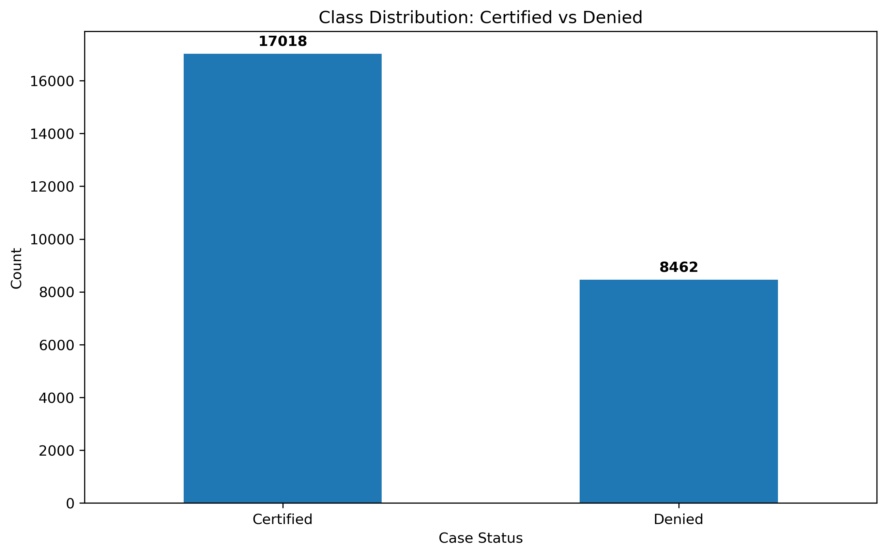

# Visa Approval Prediction — Machine Learning Classification

Machine learning project to classify visa applications as Certified or Denied using the CRISP-DM methodology.

---

## Table of Contents
- [Project Overview](#project-overview)
- [Tools & Tech Stack Used](#tools--tech-stack-used)
- [CRISP-DM Framework](#crisp-dm-framework)
  - [1) Business Understanding](#1-business-understanding)
  - [2) Data Understanding](#2-data-understanding)
  - [3) Data Preparation](#3-data-preparation)
  - [4) Modeling](#4-modeling)
  - [5) Evaluation (Tuned Models — Key Metrics)](#5-evaluation-tuned-models--key-metrics)
  - [Final Model Recommendation](#final-model-recommendation--gradient-boosting-after-tuning)
  - [Future Scope](#future-scope)
- [How to Run the Notebook](#how-to-run-the-notebook)
- [Files and Structure](#files-and-structure)

---
## Project Overview

The **Visa Approval Prediction Project** focuses on predicting whether a visa application is likely to be **certified or denied**, based on applicant and job-related attributes. With the increasing volume of visa applications each year, manual evaluation becomes slow, inconsistent, and resource-intensive.

By applying machine learning techniques on historical visa application data, this project builds classification models that support faster, more consistent, and data-driven decision-making.

This project is developed using the **CRISP-DM framework**, ensuring a structured approach from business understanding, data exploration, preparation, modeling, and evaluation.

---

## Tools & Tech Stack Used

**Programming Language:** Python  
**Environment:** Jupyter Notebook

### Libraries & Frameworks
- **NumPy, Pandas** → Data manipulation & preparation
- **Matplotlib, Seaborn** → Data visualization & EDA plots
- **Scikit-Learn** → Model building, training & evaluation

### Statistical & Analytical Techniques
- Exploratory Data Analysis (EDA)
- Distribution & skewness analysis
- Outlier detection
- Feature engineering & encoding
- Classification model comparison (tree-based models)
- Recall & F1 driven model evaluation for business impact

---

## CRISP-DM Framework

### 1) Business Understanding

EasyVisa processes thousands of visa applications. Manual screening is slow and costly, especially when a large portion of applications get denied.

This project aims to:

- Predict visa approval (Certified) vs Denied automatically
- Prioritize applications with high probability of denial
- Support better resource planning and decision-making

**Key Business Questions**

- Which features drive visa approval outcomes?
- Can ML models reduce manual review workload?
- How to reduce risk of approving unqualified applicants or rejecting qualified ones?

**Business Success Criteria**

- Achieve Recall ≥ 0.75 for Certified class (to avoid missing eligible approvals)
- Improve Recall for Denied class (to avoid approving ineligible applicants)
- Reduce manual review workload and processing time through data-driven decision support

---

### 2) Data Understanding

**Data Source:** Historical visa application dataset  
**Total Rows After Cleaning:** ~25,000

**Important Features**

- Categorical: continent, education_of_employee, has_job_experience, requires_job_training, region_of_employment, unit_of_wage, full_time_position
- Numeric: no_of_employees, prevailing_wage, yr_of_estab  
- Target: case_status (Certified = 1, Denied = 0)

**Key Insights: From EDA**

- Dataset is imbalanced: ~67% Certified vs ~33% Denied.
- Asia has the highest volume of applicants; Europe & North America follow.
- Bachelor’s & Master’s degree holders dominate the applicant pool.
- Prior job experience significantly increases certification probability.
- Majority of applicants do **not** require job training.
- Northeast region shows the highest applicant volume; Island region is the lowest.
- Most common wage unit is “Year” → indicates full-time salaried roles.
- no_of_employees is right-skewed (more smaller companies).
- yr_of_estab is left-skewed (most companies formed 1960-2015).
- Doctorate holders have the highest approval rate (~87%).
- High School applicants have the highest denial rate.
- Midwest has the highest certification rate despite lower volume.
- Full-time applicants form the majority of certified applications.

#### Class Distribution

---

### 3) Data Preparation

**Steps Performed**

- Handled missing values where present
- Validated/standardized datatypes for all columns

**Feature Engineering**

- Company Age = 2016 (FY) − yr_of_estab

**Encoding Strategy**

- Binary Encoding: Y/N → 1/0
- Ordinal Encoding: education levels
- One-Hot Encoding: continent, unit_of_wage, region_of_employment
- Label Encoding: case_status → Denied = 0, Certified = 1

**Train Split**

- 80:20 (stratified)
- Train ≈ 20,000 rows | Test ≈ 5,000 rows

---

### 4) Modeling

**Models Evaluated (Tree based)**

- Decision Tree
- Bagging Classifier
- Random Forest
- AdaBoost
- Gradient Boosting

**Evaluation Metrics Used**

- Accuracy
- Recall (for both classes) — **primary KPIs**
- F1 (especially for Denied class)
- Confusion Matrix

---

### 5) Evaluation (Tuned Models — Key Metrics)

| Model                        | Accuracy | Recall (Certified) | Recall (Denied) | F1 (Denied) |
|------------------------------|----------|--------------------|-----------------|-------------|
| Gradient Boost (After Tuning)| 0.7402   | 0.8693             | 0.4805          | 0.5512      |
| Random Forest (After Tuning) | 0.7394   | 0.8749             | 0.4669          | 0.5433      |
| Bagging (After Tuning)       | 0.7361   | 0.8822             | 0.4421          | 0.5266      |
| AdaBoost (After Tuning)      | 0.7347   | 0.8919             | 0.4184          | 0.5116      |
| Decision Tree (After Tuning) | 0.7290   | 0.9127             | 0.3593          | 0.4682      |

---

### Final Model Recommendation → **Gradient Boosting (After Tuning)**

Gradient Boosting offers the best **balanced** performance across both classes.

- Certified Recall: **0.8693** → captures most eligible applications
- Denied Recall: **0.4805** → captures denied cases better than all others
- F1 Denied: **0.5512** → best balance for minority class
- Highest Overall Accuracy: **0.7402**

Although Decision Tree gives the highest Recall for Certified (0.9127), it performs very poorly on Denied (0.3593), which is risky because it may approve too many ineligible applications.

**Why GB is the right fit for EasyVisa**

- Better detection of denied cases → reduces compliance risk
- High approval recall → avoids missing eligible applicants
- Balanced model → fairer & more trustworthy
- Helps reduce unnecessary manual reviews

**Interpretation in simple terms**

The model correctly identifies ~87% of the applications that truly deserve approval (Certified), and it correctly identifies ~48% of the applications that truly deserve rejection (Denied). This makes Gradient Boosting the most balanced model among all, minimizing the risk of missing eligible applicants while still capturing a significant portion of invalid ones.

---

### Future Scope

- Deploy model using Streamlit / FastAPI

## How to Run the Notebook

1. Clone or download this repository.
2. Open Jupyter Notebook (Anaconda / VS Code / Jupyter Lab).
3. Open the file **"Visa Application.ipynb"**.
4. Run the notebook cells sequentially from top to bottom.

> Note: This project runs fully locally and does not require deployment.

## Files and Structure

- [README.md](README.md) – Project overview and documentation
- [Visa Application.ipynb](Visa%20Application.ipynb) – Main notebook with EDA, feature engineering, model building & evaluation
- [EasyVisa.csv](EasyVisa.csv) – Dataset used for analysis and model training
- [images/class_distribution.png](images/class_distribution.png) – Visualization showing class imbalance (Certified vs Denied)
